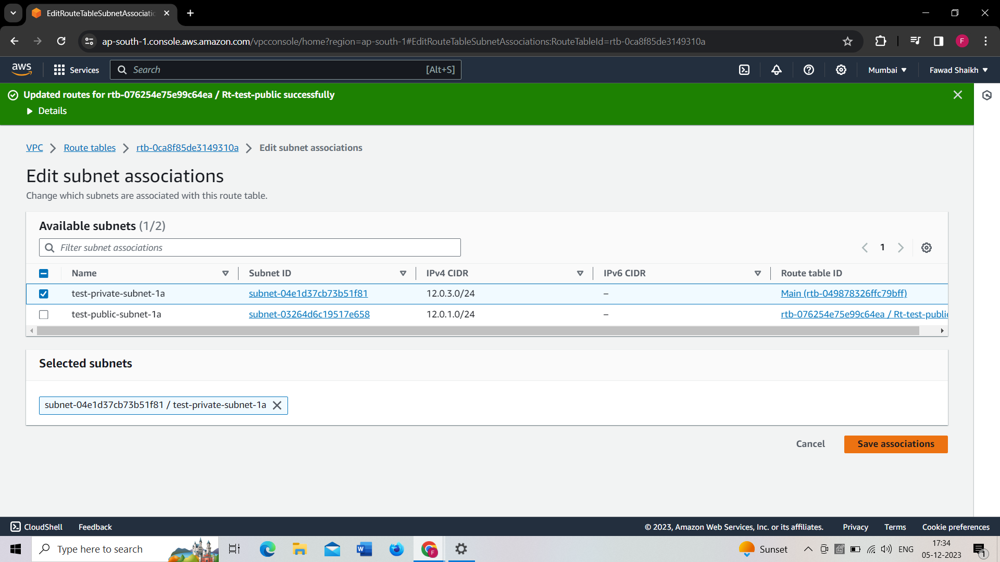

# AWS Networking Mini Project

## Overview

This mini project demonstrates the implementation of a networking setup in AWS. The setup includes a Virtual Private Cloud (VPC) with both public and private subnets, an Internet Gateway, and an EC2 instance.

## Project Structure

The Cloud Architecture comprises the following components:

### 1. Virtual Private Cloud (VPC)

- **Name:** test-vpc
- **IPv4 CIDR Block:** 12.0.0.0/16

### 2. Public Subnet

- **CIDR Block:** 12.0.1.0/24
- **Accessibility:** Publicly accessible on the internet
- **Resources:** EC2 instance for hosting websites or webpages

### 3. Private Subnet

- **CIDR Block:** 12.0.3.0/24
- **Accessibility:** Local access only, not publicly accessible
- **Resources:** Specific resources that shouldn't be accessible from the internet

### 4. Internet Gateway

- Enables internet access for resources in the public subnet.

### 5. Route Tables

#### Public Subnet Route Table

- Routes traffic to the Internet Gateway, providing internet access to resources in the public subnet.

#### Private Subnet Route Table

- Manages local traffic within the VPC, ensuring resources in the private subnet are not directly accessible from the internet.

## Step by Step Process

### 1. Creating a VPC
- And do the following Configuration
 
 

### 2. Creating a Internet Gateway
- Creating a new Internet Gateway [select IG from VPC Dashboard]

- Here, state would be detached, we need to attach it 

 
### 3. Creating Subnets
- Creating a public subnet [select subnet from VPC Dashboard]

- Now click on Add new subnet and create a private subnet 
 

 ### 4. Create Route Tables
 - Create a public route table [select route table from VPC Dashboard]

- Now click on created route table and select Edit Routes

- Select subnet associtions and edit

- Now again create a new private route table
- no need to add 0.0.0.0/0 route for this one as it only need local access

### 5. Now launch EC2 in Public subnet
- Just launch new instance
- Name it test-ec2-public-subnet
- Select the key pair
- Now edit Network settings

- Connect from SSH client

